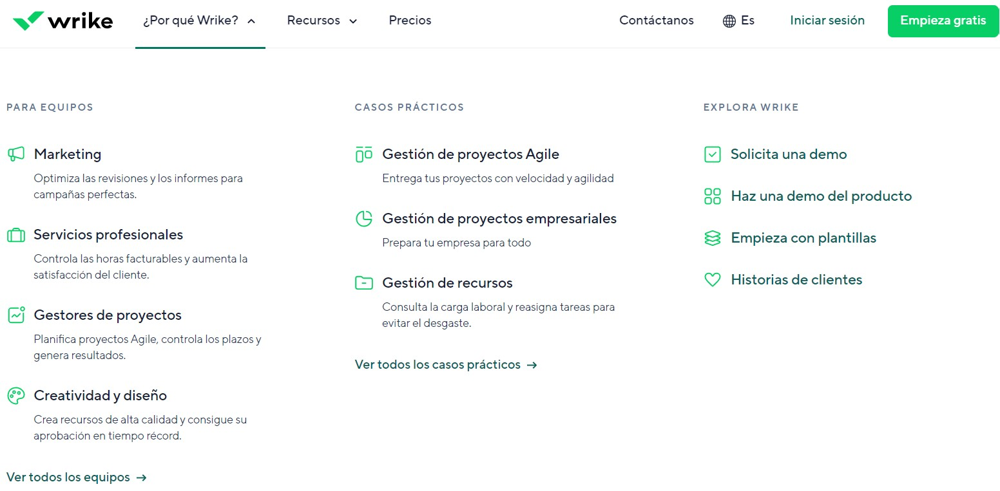
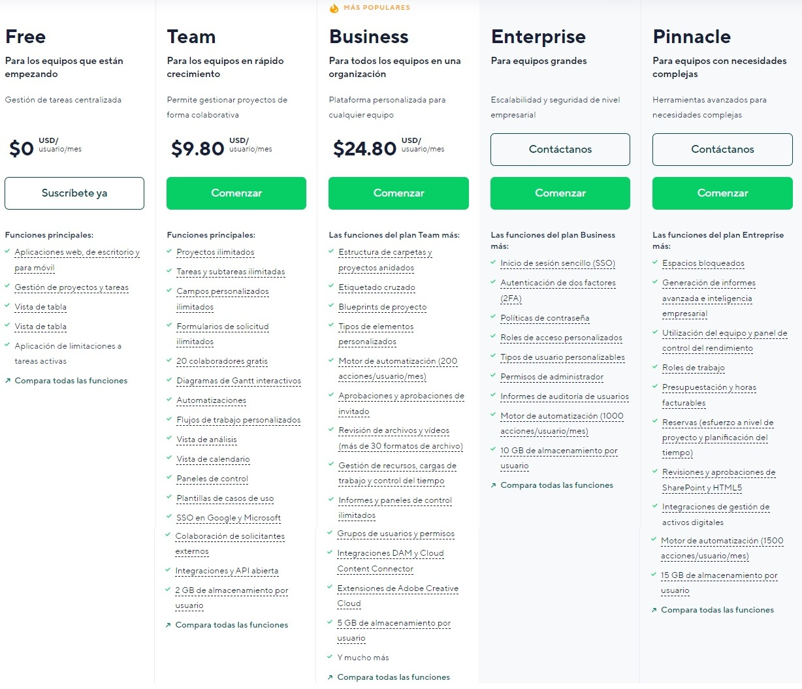

## INFORMACIÓN SOBRE WRIKE, COMPARACIÓN CON OTRAS HERRAMIENTAS Y EJEMLOS

## 1. [¿Qué son las herramientas CI/CD?](#id1)

## 2. [¿Qué es, y dentro de que grupo de las herramientas CI/CD esta?](#id2)

## 3. [¿Qué ofrece?](#id3)

## 4. [Plan de precios](#id4)

## 5. [Ejemplo de integración con repositorios de código](#id5)

## 6. [Ejemplo de documentación de proyectos](#id6)

## 7. [Otras herramientas con las que se integra](#id7)

## 8. [Comparativa con otras herramientas](#id8)

## 9. [¿Por qué escoger la herramienta frente a otras?](#id9)

## 1. ¿Qué son las herramientas CI/CD?

   - Las herramientas CI/CD, que sin abreviar hacen referencia a "Integración Continua" y "Entrega Continua", son un concepto aplicado a ciertas herramientas que hacen referencia a la capacidad de mantener ordenada u organizada una empresa o un equipo de trabajo. Con estas herramientas CI/CD conseguimos ampliar y facilitar el trabajo a los equipos de desarrollo sobre todo con los aspectos relacionados con la inegración de código.
   - El objetivo principal de estas herramintas es el adaptar las herramientas a los desarrolladores, permitiendoles trabajar al mismo tiempo en diferentes funcionalidades de una aplicación y que no suponga un problema "mezclar" todo el código. El concepto de integración continua supone continuas fusiones del código de los desarrolladores (el cual debe haber pasado antes unos test previos para que no se mezclen con errores). Algunas de las funciones que las herramientas ofrecen es el hecho de solucionar de forma ágil los fallos o conflictos cuando se sube código nuevo.
   - Respecto a la distribución continua, este es un concepto que va de la mano al anterior ya que ambos dependen del otro. La distribución continia es la capacidad de tener un código testeado y sólido (previamente mezclado por los desarrolladores) que se pueda integrar a la aplicación real en cualquier momento. Además es un concepto muy ligado a las metodologías ágiles que permiten, en cortos plazos de tiempo, mostrar al cliente los avances en el desarrollo.
   - Por último, algo a mencionar es que las herramientas CI/CD normalmente vienen preparadas para poder ser integradas con otras herramientas externas que pueden ayudar tanto a los desarrolladores de forma individual como al conjunto del equipo de desarrollo.

## 2. ¿Qué es, y dentro de que grupo de las herramientas CI/CD esta?
- Wrike es un software de gestión de proyectos que permite la representación de toda la información junto a la asignación y creación de tareas con un sistema complejo y avaznado de las mismas pudiendo incluir fechas, horas estimadas, fechas de vencimiento, prioridades...
- Dentro del grupo de facilidades que nos ofrecen las herramientas CI/DC, esta aplicación con:
  - Interfaz para todos
  - Comentarios y feedback
  - Personalización / Adaptación
  - Asistencia  

## 3. ¿Qué ofrece?

Wrike es una plataforma de gestión de proyectos y colaboración en equipo en línea. Es una herramienta que permite a los usuarios planificar, realizar un seguimiento y gestionar proyectos y tareas, asignar responsabilidades, colaborar en tiempo real, comunicarse y compartir archivos en un solo lugar.

Ofrece características como un calendario de proyectos, seguimiento de tiempo, gestión de tareas, diagramas de Gantt, integraciones con otras herramientas.

La plataforma está diseñada para ayudar a los equipos a mejorar la eficiencia y la productividad en sus proyectos.

Es utilizado por una amplia variedad de organizaciones y equipos, desde pequeñas empresas hasta grandes empresas, y se utiliza en una variedad de industrias, como la tecnología, la educación, la atención médica, la publicidad y el marketing, entre otras.

## 4. Plan de precios

- En cuanto a los precios, un punto a favor para la aplicación es que ofrece varias ofertas gratuitas para probar la aplicación, a pesar de ser con funcionañidades reducidas. Vamos a ver qué precios nos ofrece:

  - **Plan gratuito:** Este es el primer plan que podemos ver en Wrike. Es un plan totalmente gratuito que ofrece a los usuarios un uso con ciertas limitaciones para comenzar a familiarizarse con la aplicación. Es cierto que las posibilidades de uso son muy reducidas, pero contamos con los básicos para comenzar y ver si vale la pena pagar por los planes superiores. Algunas de las cosas que nos ofrece son:

    - Gestión de aplicaciones web, de escritorio y de móvil
    - Gestión de proyectos y tareas
    - Vista de tabla ofrecida por la aplicación que incluye etiquetas, asignaciones, fechas... (Similar a proyectos en github)
    - Aplicación de limites en las tareas activas
      Además, la aplicación permite el uso de una tabla scrum en caso de que no nos guste la tabla por defecto que nos ofrecen.

  - **Plan Team:** Este es el primer plan de pago que nos ofrece la herramienta. Es un plan orientado a pequeñas empresas que están comenzando a crecer y que cuentan con un grupo de desarrollo no muy extenso. Este plan nos ofrece funcionalidades extra, como pueden ser:

    - Creación ilimitada de proyectos
    - Creación de subtareas y tareas ilimitadas
    - Campos de personalización
    - 20 colaboradores gratis
    - Diagramas de Gantt
    - Automatizaciones
    - Plantillas de casos de uso
    - Integración y API abierta
      Este plan nos da muchas más posibilidades que el plan gratuito, y su coste es de 9.80 USD mensuales por usuario. La conversión a día 24/04/2023 a euros sería de 8.88€ mensuales.

  - **Plan Business:** Este es el plan más popular y adquirido de Wrike, este va orientado a empresas más grandes, con más trabajadores e incluso con varios equipos de desarrollo. Sumado a lo anterior, este plan nos ofrece:

    - Estructura de proyectos anidados
    - Blueprints de proyectos
    - Motor de automatizado avanzado
    - Sistema de invitación y de permisos
    - Gestión de recursos, cargas de trabajo y tiempos
    - Extensiones de Adobe Creative Cloud
    - Elementos personalizables
      Es un plan que abarca funcionalidades más centradas en grupos grandes, que solucionan muchas cosas relacionadas con la asignación de tareas. Además, es un plan que permite bastante personalización.

  - **Otros planes:** Los planes anteriores son los que se ofrecen de base para la herramienta, pero no son los únicos. Wrike nos ofrece los planes enterprise y pinnacle, que son planes más específicos y que cuentan con soporte de los propios desarrolladores. Por esa razón, hay que contactar con el soporte de Wrike para acordar un precio. Estos planes tienen una prueba temporal gratuita para testear lo necesario en caso de querer comprarlos. De forma similar a lo anterior, los planes incluyen bastantes más cosas relacionadas con la gestión empresarial de los grupos de trabajo. Algunas cosas como roles, permisos, contraseñas, acceso a proyectos... se añaden, junto a otras funcionalidades más específicas como revisiones de HTML5 o auditorías.

## 5. Ejemplo de integración con repositorios de código

- Esta aplicación no es una herramienta de control de versiones de código como Git, SVN u otras herramientas similares.

## 6. Ejemplo de documentación de proyectos  
- Wrike, al ser una aplicación tan orientada a la representación y asignación de tareas, la documentación de proyectos queda un poco limitada. Pero ello no quiere decir que no se pueda, pues la herramienta nos permite añadir etiquetas y descripciones además de comentarios a todas las tareas que se vayan creando. Esto hablando de la versión gratuita, que es bastante limitada. Las versiones de pago que anteriormente explicamos permiten añadir archivos de algunos tipos a la aplicaión, los cuales pueden asociarse a tareas creadas y uniendo esto junto a lo anteriormente nombrado podriamos documentar correctamente un proyecto. A pesar de que esta posibilidad exista, es ciertamente incómodo el hecho de tener el código documentado en una herramienta en la que no está alojado el propio código. Por otro lado, es cierto que la gestión del proyecto se hace mucho más sencilla por el uso y representación tan intuitiva que tiene la aplicación. 

## 7. Otras herramientas con las que se integra

Wrike se integra con una variedad de herramientas y aplicaciones, lo que permite a los usuarios conectar su flujo de trabajo y automatizar tareas.

Algunas de las integraciones más populares de Wrike:

1. Integración con Microsoft Teams: Permite a los usuarios crear, editar y asignar tareas directamente desde Microsoft Teams.

2. Integración con Slack: Permite a los usuarios crear, editar y asignar tareas directamente desde Slack.

3. Integración con Zapier: Permite a los usuarios conectar Wrike con más de 1,500 aplicaciones diferentes, lo que permite la automatización de tareas.

4. Integración con Google Drive: Permite a los usuarios adjuntar archivos de Google Drive a las tareas de Wrike.

5. Integración con Salesforce: Permite a los usuarios ver y actualizar los datos de Salesforce desde Wrike.

6. Integración con Adobe Creative Cloud: Permite a los usuarios crear y asignar tareas en Wrike directamente desde Adobe Creative Cloud.

7. Integración con Jira: Permite a los usuarios sincronizar tareas de Jira con Wrike.

Wrike también se integra con muchas otras herramientas y aplicaciones populares, como Trello, Asana, HubSpot, entre otras.

## 8. Comparativa con otras herramientas

| Herramienta | Control de Versiones | Control de Versiones de Código | Gestión de Proyectos | Integraciones | Aplicación de Escritorio | Aplicación Móvil | Características adicionales |
|---|---|---|---|---|---|---|---|
| GitLab | Git | Sí | Sí | Slack, Jenkins, Docker | Sí | Sí | Funcionalidades avanzadas de CI/CD, revisión de código y seguimiento de problemas |
| Redmine | Integración con Git y Subversion | Sí | Sí | GitHub, Subversion | No | No | Personalización avanzada de proyectos y plantillas de seguimiento, seguimiento de problemas y gestión de documentos |
| Bitbucket | Git y Mercurial | Sí | Sí | Jira, Bamboo, Trello | Sí | Sí | Funcionalidades avanzadas de CI/CD, revisión de código y seguimiento de problemas |
| Fogbugz | Integración con Git | Sí | No | GitHub, Trello | No | Sí | Funciones avanzadas de seguimiento de errores y corrección de errores, seguimiento de problemas y gestión de proyectos |
| Jira | Integración con Git, Mercurial y Subversion | Sí | Sí | Confluence, Bitbucket, GitHub | Sí | Sí | Gestión de proyectos Agile y Scrum, seguimiento de problemas y colaboración en equipo |
| Codeplane | Git y Subversion | Sí | Sí | GitHub, Bitbucket | No | No | Seguimiento básico de proyectos y tareas, revisión de código y gestión de problemas |
| Beanstalk | Git y Subversion | Sí | Sí | Jira, Basecamp, Slack | Sí | No | Funcionalidades avanzadas de CI/CD, revisión de código y seguimiento de problemas |
| Wrike | No tiene una función específica de control de versiones, pero se integra con herramientas de control de versiones como Git | Sí | Sí | Salesforce, HubSpot, Adobe Creative Cloud | Sí | Sí | Seguimiento de tiempo, análisis de carga de trabajo, planificación de recursos, gestión de proyectos y colaboración en equipo |

## 9. ¿Por qué escoger la herramienta frente a otras?

Wrike es una buena opción si buscas una herramienta de gestión de proyectos que tenga una interfaz de usuario fácil de usar y una amplia gama de funciones. Wrike se enfoca en la colaboración y la planificación de proyectos en equipo, y tiene una variedad de características adicionales como seguimiento de tiempo, análisis de carga de trabajo, planificación de recursos y automatización de procesos.

Además, Wrike también se integra con una amplia gama de herramientas y aplicaciones, incluyendo Salesforce, HubSpot y Adobe Creative Cloud, lo que lo hace muy útil para equipos que trabajan con diferentes aplicaciones.

Sin embargo, si lo que necesitas es una herramienta específica de control de versiones para código, Wrike puede no ser la opción más adecuada. En su lugar, puede ser mejor optar por una herramienta especializada en control de versiones, como GitLab o Bitbucket.

